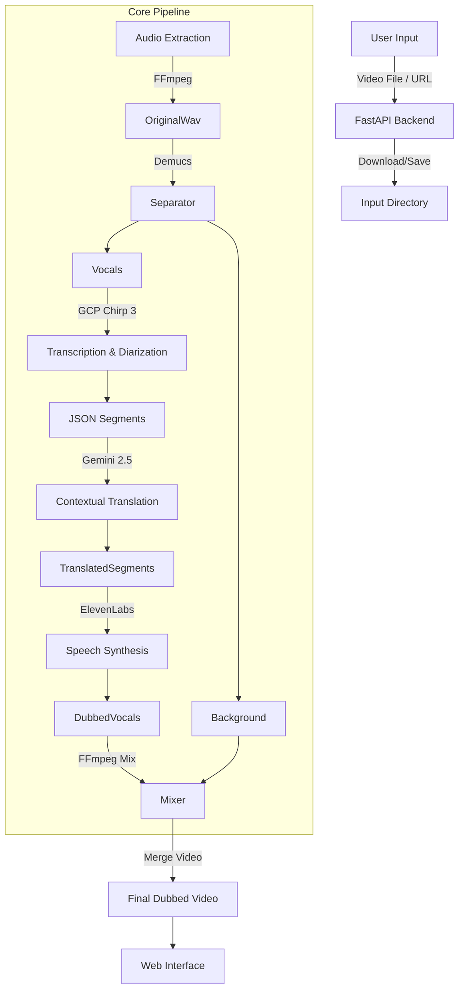

# AI Video Dubbing POC

A professional, end-to-end AI dubbing system that automatically translates and dubs videos from one language to another. The system uses advanced AI models for transcription, translation, and speech synthesis, wrapped in a user-friendly FastAPI web interface.

## 🚀 Overview

This Proof of Concept (POC) aims to demonstrate a production-ready automated dubbing pipeline. It solves the challenge of language barriers by providing sequential, context-aware dubbing that preserves the original emotion and timing of the speaker.

**Key Features:**
- **Universal Input:** Supports video file uploads (`.mp4`) and YouTube links.
- **Multi-Language Support:** Auto-detection for source languages; supports translation to Indian languages (Hindi, Tamil, Telugu, etc.).
- **Smart Pipeline:**
    - **Speech-to-Text (STT):** Google Cloud "Chirp 3" (latest model) with speaker diarization.
    - **Demucs:** Separates vocals from background music/noise.
    - **Translation:** Google Gemini 2.5 Flash for context-aware, duration-matched translation.
    - **Text-to-Speech (TTS):** ElevenLabs for high-quality, emotional voice cloning.
- **Web Interface:** Fast, server-side rendered UI with real-time performance tracking.

---

## 🛠️ Tech Stack

### AI & Core Models
- **Google Cloud Speech-to-Text v2 (Chirp 3):** For accurate, multi-speaker transcription.
- **Google Vertex AI (Gemini 2.5 Flash):** For contextual translation and emotion detection.
- **ElevenLabs:** For ultra-realistic multilingual TTS.
- **Demucs:** For audio source separation (Vocals vs. Background).
- **FFmpeg:** For all audio/video processing and mixing.

### Backend & Web
- **FastAPI:** High-performance async web framework.
- **Jinja2:** Server-side template rendering for the frontend.
- **Uvicorn:** ASGI server.
- **yt-dlp:** For robust YouTube video downloading.

### Infrastructure
- **Python 3.10+**
- **Google Cloud Storage (GCS):** Intermediate storage for large audio processing.

---

## 🏗️ High-Level Architecture

The system follows a linear pipeline architecture orchestrated by `core/pipeline.py`.



### Component Details
1. **Audio Extraction:** Extracts audio track from the uploaded video.
2. **Separation (Demucs):** Splitting audio ensures we remove the original voice but keep background music and sound effects (SFX) for the final mix.
3. **Transcription (GCP):** Converts speech to text with timestamps and speaker labels.
4. **Translation (Gemini):** Translates text while respecting the time duration of the original phrase (isochrony) to match lip-syncing loosely.
5. **Synthesis (ElevenLabs):** Generates new speech in the target language.
6. **Mixing:** Combines the new speech with the preserved background track and merges it back into the video.

---

## 📂 Folder Structure

```
c:\Immersive_projects\Voice_dubb_poc\
├── audio/                  # Intermediate audio files (original, separated, dubbed)
├── core/                   # Core logic modules
│   ├── audioextractor.py   # FFmpeg wrapper for extraction
│   ├── dubbing.py          # ElevenLabs TTS & mixing logic
│   ├── pipeline.py         # Main orchestrator function
│   ├── separator.py        # Demucs wrapper
│   ├── transcribe.py       # Google Cloud STT logic
│   └── translator.py       # Google Gemini translation logic
├── input/                  # Directory for uploaded/downloaded videos
├── output/                 # Final processed videos
├── static/                 # CSS and assets
├── templates/              # Jinja2 HTML templates
├── .env                    # Environment variables (API Keys)
├── main.py                 # FastAPI application entry point
└── requirements.txt        # Python dependencies
```

---

## ⚡ Setup & Installation

### Prerequisites
- Python 3.10 or higher.
- **FFmpeg** installed and added to system PATH.
- **Google Cloud Account** with Speech-to-Text and Vertex AI enabled.
- **ElevenLabs Account**.

### 1. Clone & Install Dependencies
```bash
pip install -r requirements.txt
```

### 2. Environment Configuration
Create a `.env` file in the root directory with the following keys:

```env
# Google Cloud
GCP_PROJECT_ID=your-project-id
GCP_REGION=us-central1
GOOGLE_APPLICATION_CREDENTIALS=path/to/your/service-account.json
GCS_BUCKET_NAME=your-gcs-bucket-name

# Gemini (Vertex AI)
GEMINI_MODEL=gemini-2.5-flash
GEMINI_REGION=us-central1

# ElevenLabs
ELEVENLABS_API_KEY=your-elevenlabs-api-key
```

### 3. Google Cloud Setup
- Enable **Cloud Speech-to-Text API** & **Vertex AI API**.
- Create a GCS bucket for temporary audio storage.
- Ensure your Service Account has permissions: `Storage Object Admin`, `Vertex AI User`, `Speech Administrator`.

---

## 🚀 How to Run

Start the server using Uvicorn:

```bash
uvicorn main:app --reload --port 5000
```

- Open your browser at: `http://127.0.0.1:5000`
- **Port Note:** Default is 5000 (standard for local Flask/FastAPI dev on Windows to avoid conflict with system services).

---

## 🔄 System Data Flow & Architecture Breakdown

This section details the step-by-step data flow for creating a system architecture diagram.

### Phase 1: Input Handling (Frontend -> Backend)
1. **User Action:** User uploads a video file (`.mp4`) OR pastes a YouTube URL via the Web UI (`index.html`).
2. **Request:** The browser sends a `POST /process` request to the **FastAPI Backend**.
3. **Ingestion:**
   - **If File:** FastAPI receives the `UploadFile` stream and saves it to `input/`.
   - **If URL:** The backend runs `yt-dlp` to download the high-quality video stream to `input/`.
   - **Output:** A local file path (e.g., `input/video.mp4`) is passed to the pipeline.

### Phase 2: Audio Pre-processing (Core Pipeline)
4. **Extraction:** `ffmpeg` extracts the raw audio track (`.wav`) from the input video.
   - *Input:* `input/video.mp4` -> *Output:* `audio/video_original.wav`
5. **Source Separation (Demucs):** The `demucs` model processes the audio to separate vocals from the background (music/noise).
   - *Input:* `video_original.wav`
   - *Output A:* `separated/htdemucs/video_original/vocals.wav` (Speech only)
   - *Output B:* `separated/htdemucs/video_original/no_vocals.wav` (Background only)

### Phase 3: Intelligence Layer (AI Models)
6. **Transcription (STT):**
   - The `vocals.wav` is sent to **Google Cloud Speech-to-Text v2 (Chirp 3)**.
   - **Process:** The audio is uploaded to a temporary GCS bucket securely.
   - **Diarization:** The model identifies individual speakers (Speaker 0, Speaker 1, etc.) and timestamps.
   - *Output:* A list of JSON segments: `[{start: 0.5, end: 2.1, speaker: 1, text: "Hello world"}]`.
7. **Translation (LLM):**
   - The segments are sent to **Google Vertex AI (Gemini 2.5 Flash)**.
   - **Context:** The prompt includes the duration of each segment to enforce time-constrained translation.
   - *Output:* JSON segments with translated text in the target language (e.g., Hindi).

### Phase 4: Synthesis & Post-processing
8. **Speech Synthesis (TTS):**
   - **ElevenLabs API** is called for each translated segment.
   - **Sequential Logic:** Segments are generated one by one to respect concurrency limits.
   - **Durations:** If the generated audio is longer than the original time slot, `ffmpeg` applies a tempo filter (speed up) to fit it exactly.
   - *Output:* A collection of individual small `.mp3` files for each dialogue line.
9. **Audio Mixing:**
   - `ffmpeg` takes all TTS clips and places them at their exact start timestamps on a timeline.
   - The original **Background track** (`no_vocals.wav`) is mixed in.
   - *Output:* A single continuous audio track (`audio/video_dubbed_hi.aac`).

### Phase 5: Final Assembly
10. **Video Merging:**
    - `ffmpeg` replaces the audio track of the original video with the new dubbed audio track.
    - *Input:* `input/video.mp4` + `audio/video_dubbed_hi.aac`
    - *Output:* `output/video_hi.mp4`
11. **Delivery:** The path to the final video is returned to the frontend, which renders the `<video>` player.

---

## 🛡️ Error Handling

- **STT Timeouts:** The system handles long audio chunks by using Batch Mode in GCP.
- **Translation Retries:** Exponential backoff implemented for Gemini API calls.
- **Concurrency:** Audio segments are processed sequentially where necessary to avoid rate limits (ElevenLabs).
- **Frontend Feedback:** Users see a loading spinner and detailed error messages if processing fails.

---

## 🔮 Future Roadmap

- [ ] **Lip Sync:** Use models like Wav2Lip to match video lip movements with new audio.
- [ ] **Voice Cloning:** Auto-clone the original speaker's voice using ElevenLabs Instant Cloning.
- [ ] **Streaming Support:** Process and stream video chunks in real-time.
- [ ] **User Accounts:** Save history of dubbed videos.

---

## 📅 Production Transition Timeline (12 Weeks)

**Goal:** Convert this POC into a scalable, production-grade SaaS module.
**Estimated Effort:** ~480 Hours (12 Weeks @ 40h/week).

### Component Breakdown

| Component | Responsibility | Estimated Effort |
| :--- | :--- | :--- |
| **1. Planning & Architecture** | Scoping, DB Schema, API Design | **40 Hours** |
| **2. Infrastructure & DevOps** | Docker, GCP Setup, CI/CD | **40 Hours** |
| **3. Backend Core** | FastAPI (Async), Database, Auth, Job Queue | **100 Hours** |
| **4. Core AI Pipeline** | Robustness, Error Handling, Optimization | **100 Hours** |
| **5. Frontend (UI/UX)** | Modern Dashboard, Real-time Status, Editor | **100 Hours** |
| **6. QA & Testing** | Unit/Integration Tests, Performance, Security | **60 Hours** |
| **7. Launch & Docs** | User Manuals, API Docs, Deployment | **40 Hours** |

### Detailed Schedule

#### Phase 1: Foundation (Weeks 1-2)
- **Week 1:** Requirements, Async Architecture Design, DB Schema (PostgreSQL), API Spec.
- **Week 2:** Docker containerization, GCP setup (GKS/Cloud Run), CI/CD pipelines.

#### Phase 2: Core Development (Weeks 3-6)
- **Week 3:** Auth (OAuth2), DB Integration (AsyncPG), Secure File Management.
- **Week 4:** **Job Queue Engine** (Celery/Redis) implementation for async processing.
- **Week 5:** AI Pipeline Refactoring (Recoverable steps, Error handling with backoff).
- **Week 6:** Quality Improvements (Smart Diarization, Context-aware Translation).

#### Phase 3: Frontend & Experience (Weeks 7-9)
- **Week 7:** Next.js Project Setup, Dashboard, Project Management UI.
- **Week 8:** Real-time progress updates (WebSockets), Custom Video Player.
- **Week 9:** **Transcript Editor** (Edit before dubbing), Regeneration flows.

#### Phase 4: Reliability & Launch (Weeks 10-12)
- **Week 10:** Comprehensive Testing (Unit, Integration, Load).
- **Week 11:** Security Audit, Cost Optimization, UI Polish.
- **Week 12:** Documentation (Tech/User), Final Release.

---
© 2026 AI Dubbing POC Team.
